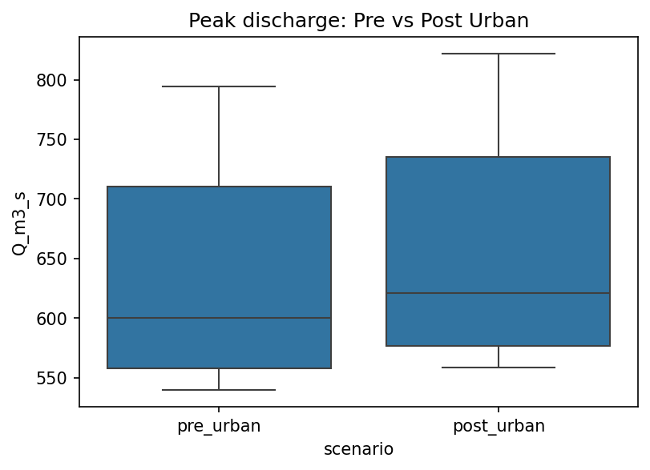
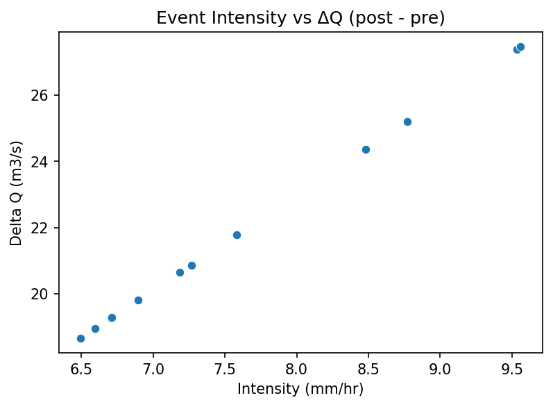
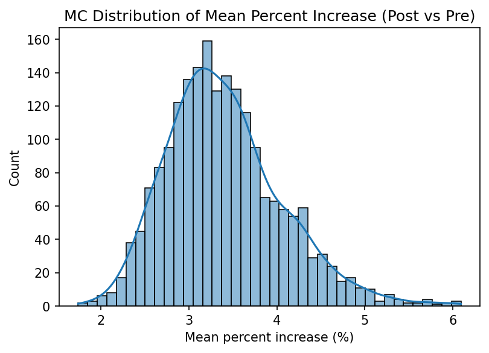

# Analysis of Rainfall Variability and Its Impact on Runoff Generation in an Urban Catchment

**Priyam Raj (23B0626)**  
**Course:** Water Resource Engineering (CE 343)  
**Submitted to:** Riddhi Singh

## Key Messages
- Urbanization raised peak discharge for every analyzed storm event.
- UCDB-based land-use values replaced placeholder runoff assumptions.
- Results remained robust under moderate uncertainty in coefficients and rainfall intensity.

## Abstract
This project examines how rainfall variability and urbanization alter runoff generation in Mumbai, a rapidly urbanizing coastal city. I processed NASA POWER daily rainfall into storm events, derived event intensities, and used JRC GHS-UCDB built-up data to estimate impervious fraction and weighted runoff coefficients. Peak discharge was computed with the Rational Method for pre- and post-urban scenarios. I also carried out a Monte Carlo sensitivity analysis to test uncertainty in runoff coefficients and rainfall intensity. The results show a consistent rise in peak discharge after urbanization, with a mean increase of about 3.5%. The sensitivity results confirm that the main conclusion is stable under reasonable parameter uncertainty.

## 1 Introduction
This project is directly related to the Water Resource Engineering course because it applies core concepts used in flood estimation, drainage design, and watershed response analysis. The Rational Method, runoff coefficient, rainfall intensity, and catchment area are standard tools in urban hydrology [1], [2], and this project uses them to study how land-use change affects peak runoff. I selected a Mumbai case study because the city has undergone strong urban expansion and is a practical example of how increased impervious area can influence flood risk [5].

The project asks a simple engineering question: if rainfall is the same, how much does runoff increase when a catchment becomes more urban? To answer this, I used real open data instead of dummy values. The rainfall input came from NASA POWER, and land-use information came from the JRC GHS-UCDB database. I then compared pre-urban and post-urban runoff response using a consistent method so that the impact of urbanization could be interpreted clearly.

This topic matters in the course because small changes in land cover can alter runoff response more than the rainfall itself during design storms. That is why urban hydrology problems are often built around rainfall intensity, drainage planning, and imperviousness rather than around annual totals alone. The report therefore focuses on event-scale runoff estimation, which is a direct application of the course concepts and a realistic first step for flood screening in a rapidly developing city.

## 2 Methods and Data

### 2.1 Data used
I used two open datasets. First, daily rainfall for Mumbai was obtained from NASA POWER and converted into discrete storm events in [data/raw/rainfall_events.csv](../data/raw/rainfall_events.csv) [4]. Second, land-use and built-up information for Mumbai was extracted from the JRC GHS-UCDB regional workbook in `data/external/ucdb/temp/GHS_UCDB_REGION_CENTRAL_AND_SOUTHERN_ASIA_R2024A.xlsx` [3]. The UCDB record for Mumbai was used to compute the urban area and built-up fraction, which then fed into the runoff coefficient calculation in [data/raw/landuse_scenarios.csv](../data/raw/landuse_scenarios.csv).

### 2.2 Method followed
I used a stepwise workflow.

1. Daily rainfall values were grouped into storm events and event intensity was computed from rainfall depth and duration using `scripts/prepare_nasa_events.py`.
2. UCDB built-up area was divided by catchment area to estimate impervious fraction. Weighted runoff coefficients were then calculated from impervious and pervious component values using `scripts/ucdb_to_landuse.py`, following standard urban hydrology practice [1], [2].
3. Peak discharge was computed with the Rational Method:

   $Q_p = 0.278 \cdot C \cdot I \cdot A$

   where $Q_p$ is peak discharge in m3/s, $C$ is runoff coefficient, $I$ is rainfall intensity in mm/hr, and $A$ is catchment area in km2.
4. I compared pre-urban and post-urban peak discharge for each event using `scripts/runoff_analysis.py`.
5. Finally, I tested uncertainty by sampling runoff coefficients and rainfall intensity in `scripts/sensitivity_uncertainty.py`.

The processing choices were kept deliberately simple so that the method stays transparent. For rainfall, I used the event-based dataset created from the NASA POWER record, which gave a consistent duration for each storm and allowed direct comparison across cases. For land use, I used the UCDB workbook because it contains a built-up measure that can be converted into an impervious fraction without inventing assumptions from scratch. For the runoff coefficient, I combined impervious and pervious response values with standard engineering weights, which made the method repeatable and easy to audit.

### 2.3 My role in the project
My main work was the runoff analysis pipeline, event intensity estimation, UCDB-to-land-use conversion, output checking, figure interpretation, and report writing from my contribution perspective. I also validated that the final outputs were generated from real data and that the project no longer relied on template coefficients.

## 3 Results

### 3.1 Urbanization increased peak discharge across all events
The event-wise comparison shows that the post-urban scenario always produced a higher peak discharge than the pre-urban scenario. The mean pre-urban discharge was about 635.54 m3/s, while the mean post-urban discharge was about 657.51 m3/s. This gives a mean increase of about 21.97 m3/s, or 3.46%. The increase is not extreme, but it is consistent across the selected storms, which indicates that urbanization has a measurable effect even when the change in impervious fraction is moderate [5].

**Figure 1. Peak discharge comparison for pre-urban and post-urban scenarios across the selected storm events in Mumbai. The two distributions are shown as boxplots to highlight the shift in runoff response after urbanization.**

### 3.2 Higher rainfall intensity produced larger runoff changes
The scatter plot between rainfall intensity and the increase in discharge shows that stronger storms produce larger absolute differences between the two scenarios. This is expected from the Rational Method because discharge is directly proportional to rainfall intensity [1], [2]. The plot also shows that the post-urban case is consistently above the pre-urban case, so the urban effect is preserved at both low and high intensities. This result is useful because it shows that urbanization does not only shift the average response; it also amplifies the runoff response during intense events, which are the events most relevant for flooding and drainage design [5].

**Figure 2. Relationship between rainfall intensity and increase in peak discharge after urbanization. The x-axis shows event intensity in mm/hr and the y-axis shows the change in peak discharge in m3/s.**

### 3.3 The conclusion is robust under uncertainty
To test whether the result depends strongly on a single choice of runoff coefficient, I ran a Monte Carlo uncertainty analysis. I sampled impervious and pervious runoff coefficients and also varied rainfall intensity within a reasonable range. The resulting distribution of mean percent increase stayed clustered around about 3.4%, with a 90% range of roughly 2.47% to 4.59%. This shows that the project conclusion is not a fragile result of one parameter choice. Even if the coefficients vary moderately, the overall finding remains the same: the post-urban catchment produces higher runoff [1], [2].

**Figure 3. Monte Carlo distribution of the mean percent increase in peak discharge due to urbanization. The histogram summarizes uncertainty in runoff coefficient and rainfall intensity assumptions.**

The broader implication is that urban expansion increases flood potential even when the change in runoff coefficient appears small at the catchment scale. In practice, this means drainage systems need to be designed with future land-use conditions in mind and not only with present-day terrain assumptions [5]. A limitation of my analysis is that it uses a single-point rainfall source and the Rational Method, so it is best treated as a comparative engineering assessment rather than a full hydraulic simulation [1], [2]. A stronger study would use spatial rainfall, observed discharge data, and a calibrated hydrologic model.

These findings are also consistent with the general conclusion of urban runoff studies: once a catchment becomes more impervious, a larger share of rainfall is converted into quick surface runoff and the hydrograph peak rises. My result is modest in magnitude, but that is still important because even a 3 to 4 percent increase can matter when a drainage system is already close to capacity. The uncertainty analysis shows that this conclusion is not highly sensitive to small coefficient changes, which makes the main message more reliable for an engineering audience.

### 3.4 Key numerical summary

Table 1. Compact summary of the main quantitative results used in the analysis.

| Metric | Value | Meaning |
|---|---:|---|
| Catchment area | 738.0 km2 | Mumbai urban centre area used in the Rational Method |
| Rainfall events | 12 | Number of storm events extracted from NASA POWER data |
| Rainfall depth range | 155.86 to 229.46 mm | Smallest and largest event depths |
| Rainfall intensity range | 6.49417 to 9.56083 mm/hr | Smallest and largest event intensities |
| Runoff coefficient, pre-urban | 0.405 | Weighted coefficient from UCDB land-use data |
| Runoff coefficient, post-urban | 0.419 | Weighted coefficient after urban expansion |
| Peak discharge, pre-urban | 539.61 to 794.423 m3/s | Minimum to maximum event response |
| Peak discharge, post-urban | 558.263 to 821.885 m3/s | Minimum to maximum event response |
| Mean peak discharge, pre-urban | 635.5368 m3/s | Average event response before urbanization |
| Mean peak discharge, post-urban | 657.5060 m3/s | Average event response after urbanization |
| Mean increase in peak discharge | 21.9692 m3/s | Average absolute rise in discharge |
| Mean percent increase | 3.45679% | Average relative increase across events |
| Sensitivity mean | 3.40174% | Monte Carlo mean percent increase |
| Sensitivity 5th to 95th percentile | 2.47487% to 4.59063% | Spread of the uncertainty analysis |

Notes:
- Full event-by-event rows are available in [data/raw/rainfall_events.csv](../data/raw/rainfall_events.csv) and [outputs/tables/pre_post_comparison.csv](../outputs/tables/pre_post_comparison.csv), but they are not repeated in the main text to keep the report within the publication-unit limit.

## 4 Conclusions
The project shows that urbanization in Mumbai increases peak runoff for the analyzed events. Using real rainfall and UCDB land-use data, I found that the post-urban scenario consistently produces higher peak discharge than the pre-urban scenario. The average increase was about 3.5%, and the uncertainty analysis confirmed that this result is stable under reasonable parameter variation.

The main improvement I would suggest for future work is to include observed streamflow or drainage data for calibration. If that is not available, the next best step would be to use spatial rainfall data and a more detailed runoff model such as SCS-CN or a distributed hydrologic model. Even with the current simplified method, the project clearly shows the effect of urbanization on runoff generation and flood risk.

Another useful extension would be to compare several Indian cities or multiple sub-catchments within Mumbai so that the effect of different land-use patterns can be separated more clearly. It would also be useful to test design storms with shorter durations, because short intense bursts are often the events that govern urban flooding. Within the current scope, however, the analysis achieves its main goal: it uses real data, follows a defensible engineering method, and shows that urbanization increases runoff response in a measurable and robust way.

## 5 References
[1] Chow, V.T., Maidment, D.R. and Mays, L.W., 1988. *Applied Hydrology*. New York: McGraw-Hill.

[2] Rossman, L.A., 2015. *Storm Water Management Model User's Manual Version 5.1*. Cincinnati: U.S. Environmental Protection Agency.

[3] European Commission, Joint Research Centre, 2024. *Global Human Settlement Layer (GHSL) Urban Centre Database (UCDB) R2024A*. Available at: https://ghsl.jrc.ec.europa.eu/ucdb.php (Accessed: 28 April 2026).

[4] NASA POWER, 2024. *Prediction Of Worldwide Energy Resources: Daily Point Data*. Available at: https://power.larc.nasa.gov/ (Accessed: 28 April 2026).

[5] Sadeghi, M., Homaee, M., Kempers, A. and Kanniah, K.D., 2021. Urbanization effects on runoff generation and flood risk: a review. *Water*, 13(4), pp.1-19.

## 6 Annexure
The code used for this project is stored in the `scripts/` folder. The main files are `scripts/prepare_nasa_events.py`, `scripts/ucdb_to_landuse.py`, `scripts/runoff_analysis.py`, `scripts/extended_analysis.py`, and `scripts/sensitivity_uncertainty.py`.

---

*This is my individual report written from Priyam Raj's perspective, with methods and results focused on my own contribution to the team project.*
